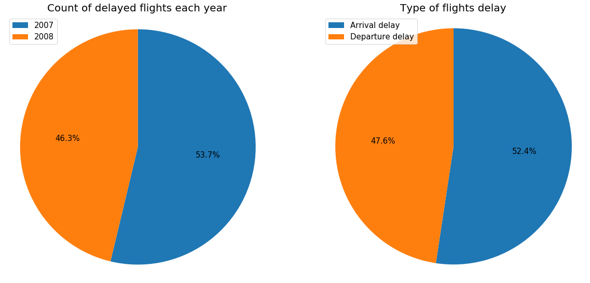
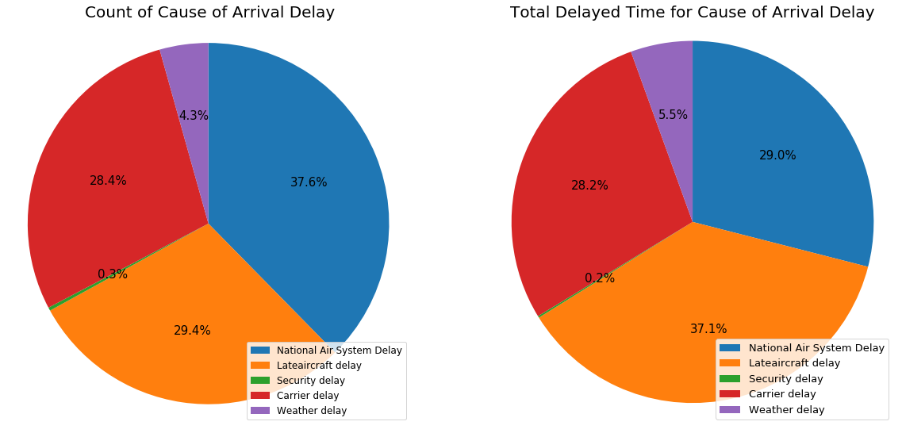
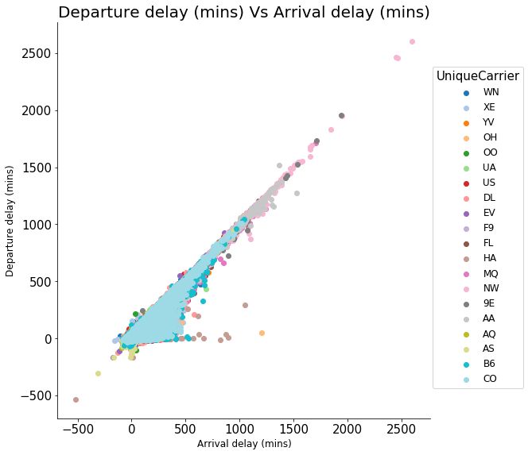
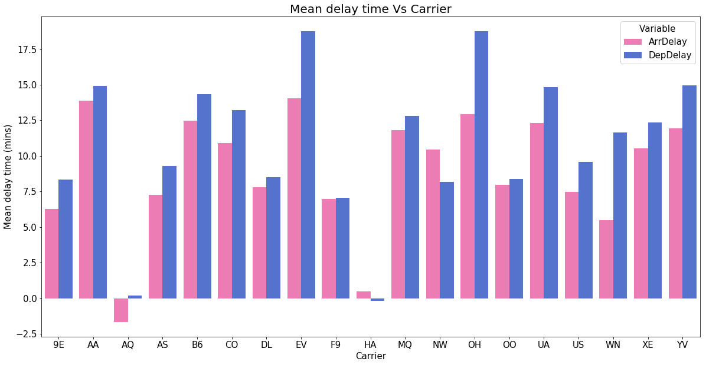
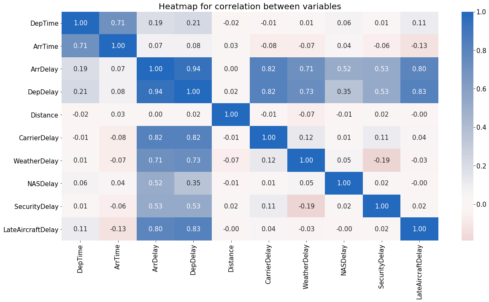

# Communicate Data Findings
## Introduction

In this project **Flight dataset for year 2007 and 2008** is analyzed. First the data is accessed and cleaned and then various univariate, bivariate multivariate visualizations are created to explore the relationship between variables in the dataset. And then final results are communicated via the explanatory analysis.

## Exploratory Data Analysis
### Univariate Data Exploration:
1. Data was gathered for two years 2007 and 2008. So the first step of analysis was to plot which year had the highest number of total flights, so that there is no biasness while comparing results. And after plotting a pie chart, it was observed that year 2007 had slightly high number of flights that is 51.5%.
2. Next step, was to check which carrier had the highest and least number of flights over two years. And after plotting a bar chart it was observed that WN- Southwest airline had the highest number of total flights whereas AQ had the least.
3. A histogram was plotted for distance between airport to find what is the average distance a flight covers, and it was around 500 miles.
4. A histogram was plotted for all delayed times (cause of delay times) on a logarithmic xscale, and the average delay time was centered around 30 mins.

### Bivariate Data Exploration:

1. By faceting, histograms for each delay cause were plotted to observe which cause had the highest mean and spread. And it was observed that NASdelay had highest mean while security delay had the least.
2. Also, using faceting arrival delay and deprature delay histogram were plotted to observe the mean and spread of each. It was observed that arrival delay had high mean than departure delay.
3. The next step was to observe which cause had the highest count of delayed flights and which cause had the highest total time for delay. This exploration was plotted on two pie subplots. First pie subplot for count of each cause of delay and the second pie subplot for total delay time for each cause of delay. It was observed that Late aircraft delay had the higest count of delay flights and total delay time as well. But the main observation in this phase was that though carrier delay and NAS delay account for less than 5% of the total count, they cover individually around 30% of the total delay time. 
4. A scatter plot was created for arrival and delay time to observe the relationship between them. And a strong positive relationship was observed.
5. A heatmap was created to observe relationship between arrival and departure time and a strong positive reationship was observed.
6. A clustured bar chart was created to observe which year had highest cancelled flights and what was the cause of cancellation. It was observed that 2007 had high cancceled flights with carrier as the cause with highest cancellation, while weather for 2008.
7. As we observed carrier is the reason for most of the delayed flights a box plot was created for arrival times of all carriers and it was observed that NW, 9E, AA had high delay times

### Multivariate Data Exploration:
1. A heatmap was created to observe the corelation between all numeric variables of the flight data. And it was observed that  Arrival delay and Departure delay has strong positive relationship with Lateaircraft delay ,Carrier delay, Nas delay, Security delay, and Distance. Also, Actual time elapsed has a strong positive relationship with distance. And Arrival time has strong positive relationship with Departure time. Some weak negative relationship can be observed between weather delay and security delay.
2. As we observed carrier was the cause of majority of delay times, a clustered bar chart was created with x-axis as carrier and y as mean delay time and two bars one for arrival delay and one for departure delay. It was observed that EV and OH have high mean arrival and departure delay times. Also AA has high mean arrival delay time.
3. A matrix plot was created to observe the relationship between mean delay times for delay causes. It was observed that there is a positive relationship between the causes.

## Explanatory Data Analysis
1. The first thing we would like to know is which year had the highest percentage of delayed flights and if it was an arrival delay or departure delay? The below pie chart shows that 2007 had high percentage of delayed flighs (53.7 %) compared to the delayed flights in 2008. And, 52.4 % of the time it was an arrival delay.  
 

2. Now that we know, if a flight is going to be delayed it is more likely to be an arrival delay. What can be the cause of these arrival delays? The below pie chart shows the percentage of count of each cause of delay and it is observed that 37.6 % of times it is national air system delay. Also, 30 % of times delay is caused because of carrier or weather. But if we observe total delay time percentage, late aircraft delay has the highest percentage of total delay time followed by national air system delay and carrier delay.
 

3. We observed the cause for delayed flights, but what can be said for the cancelled flights? what is the main cause for a flight to be cancelled? It can be observed from below bar chart that Carrier and Weather are two main reason for a flight to be cancelled with Carrier being the highest. So if a flight is cancelled, it is more likely to be because of the airline carrier.
 

4. Now that we know Carrier is main reason for a flight to be cancelled and one of the main treasons for a flight to be delayed, which carriers are responsible for high delay times? From the below scatter plot we can observe that NW (Southwest airlines), 9E (Endeavor Air Inc) and AA (American Airlines Inc.) carriers have highest arrival and departure delay times over the two years.
 

5. We observed that NW (Southwest airlines), 9E (Endeavor Air Inc) and AA (American Airlines Inc.) have high arrival and departure delay times, does this mean they always arrive and delay late? From below clustered bar chart we can observe that though NW, 9E and AA have peak arrival and departure delay times, their average delay times are less compared to other carriers. On the other hand, EV(ExpressJet Airlines Inc.) and OH (PSA Airlines Inc.) hive high mean arrival and departure delay times.
 

6. Is there any relationship between arrival delay, departure delay or the other causes of delay? From the below heatmap it can be observed that arrival delay and departure delay has strong positive relationship with lateaircraft delay ,carrier delay, national air system delay, security delay, and distance. And arrival time has strong positive relationship with departure time. Some weak negative relationship can be observed between weather delay and security delay. This means that as the time of each cause of delay increases so does the time for arrival and departure delay.
 

